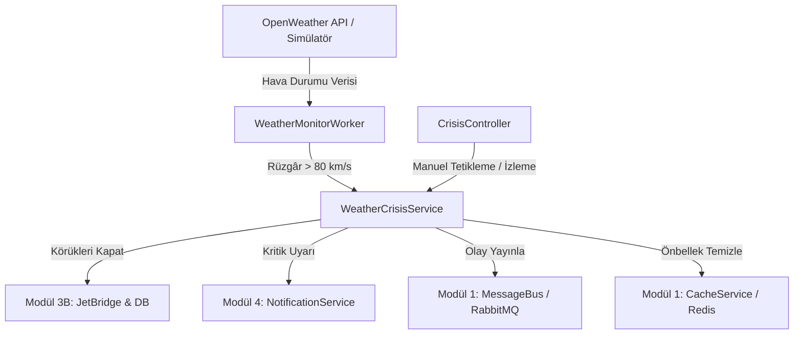

# Modül 7: Dış Veri Entegrasyonu ve Kriz Yönetimi (Simülasyonlar & Otomasyon)

Bu döküman, **AeroPulse** projesinin 7. modülü olan dış hava durumu veri entegrasyonu, otonom arka plan izleyicisi (Background Worker) ve acil durum kriz yönetimi sistemini, yazılıma yeni başlayan birinin kolayca kavrayabileceği benzetmelerle ve adım adım açıklamaktadır.

---

## 1. Modülün Amacı ve Günlük Hayattan Benzetme

### Amacı:
Havalimanları aşırı hava olaylarına (özellikle şiddetli rüzgâr, windshear, fırtına vb.) karşı en hassas tesislerdir. Rüzgâr hızı emniyet limitlerini (örn: 80 km/s) aştığında uçaklara bağlı olan yolcu körükleri (Jet Bridges) devrilebilir, uçak kapısına zarar verebilir veya yolcuların can güvenliğini tehlikeye atabilir.

Bu modülün amacı; havalimanı hava durumunu dış bir kaynaktan (OpenWeatherMap API) **otonom ve periyodik** olarak dinlemek, kritik bir eşik aşıldığında **insan müdahalesine gerek kalmadan anında acil durum protokolünü devreye sokmaktır.**

### Günlük Hayattan Benzetme:
Bir akıllı binadaki **"Yangın Algılama ve Otomatik Yağmurlama Sistemi"** gibidir:
- Sensörler sürekli havadaki dumanı ve ısıyı kontrol eder (Arka plan işçisi - `WeatherMonitorWorker`).
- Isı ve duman kritik seviyeyi geçtiğinde sistem alarm çalar, itfaiyeyi arar, asansörleri zemin kata kilitler ve kapıları açar (Kriz Yönetim Servisi - `WeatherCrisisService`).
- Tehlike geçince bina yöneticisine "Tehlike geçti, sistemler normale dönebilir" mesajı gider.

---

## 2. Bu Modülde Hangi Class'lar Oluşturuldu ve Ne İşe Yararlar?

### 1. `OpenWeatherService` (ve `IWeatherService`)
- **Katman:** `AeroPulse.Infrastructure`
- **Benzetme:** Meteoroloji İstasyonu Gözlemcisi.
- **Görevi:** OpenWeatherMap API'sine HTTP istekleri atarak (`HttpClient`) güncel sıcaklık, nem, rüzgâr hızı, rüzgâr esintisi (gust) ve hava durumu açıklamalarını çeker. API anahtarı girilmemişse sistemi kilitlemez; otomatik olarak gerçekçi simülasyon (mock) verileri üretir.

### 2. `WeatherMonitorWorker`
- **Katman:** `AeroPulse.Infrastructure / BackgroundServices`
- **Benzetme:** 7/24 nöbet tutan kule nöbetçisi.
- **Görevi:** .NET'in `BackgroundService` sınıfından türetilmiştir. Uygulama ayağa kalktığında otomatik olarak arka planda sessizce çalışmaya başlar. Belirlenen periyotta (örn: her 5 dakikada bir) hava durumunu kontrol eder, rüzgâr limitin üzerine çıktığında kriz servisini tetikler.

### 3. `WeatherCrisisService` (ve `IWeatherCrisisService`)
- **Katman:** `AeroPulse.Application`
- **Benzetme:** Kriz Masası Başkanı.
- **Görevi:** Kriz tetiklendiğinde veya çözüldüğünde yapılması gereken tüm iş mantığını (Business Logic) yürütür:
  - Körükleri emniyet amacıyla "UnderMaintenance" (Kullanım Dışı) statüsüne çeker.
  - Önbelleği (Redis/MemoryCache) temizler.
  - RabbitMQ mesaj kuyruğuna olay fırlatır.
  - Yetkili kullanıcılara (Operasyon Yöneticileri ve Adminler) acil durum bildirimi gönderir.
  - Spam koruması uygulayarak sistemin kilitlenmesini engeller.

### 4. `CrisisController`
- **Katman:** `AeroPulse.API`
- **Benzetme:** Acil Durum Butonları ve Durum Ekranı.
- **Görevi:** Ön yüzden (Angular/Mobil) veya Swagger'dan kriz durumunu sorgulamaya (`GET /api/crisis/status`), güncel hava durumunu görmeye (`GET /api/crisis/weather`) ve gerektiğinde simülasyon veya tatbikat için manuel kriz tetiklemeye (`POST /api/crisis/wind/trigger`) olanak tanır.

### 5. DTO Sınıfları (`CrisisDtos.cs`)
- **`TriggerWindCrisisRequestDto`:** Kriz başlatırken gönderilen parametreler (lokasyon, rüzgâr hızı, gerekçe).
- **`ResolveWindCrisisRequestDto`:** Krizi çözerken gönderilen parametreler (körükler açılsın mı?).
- **`CrisisOperationResultDto`:** Kriz işlemi sonucunda dönen özet bilgi (etkilenen körük adedi, bildirim sayısı).
- **`CrisisStatusDto`:** Sistemin o anki durumunu gösteren veri modeli.

---

## 3. Metotlar (Fonksiyonlar) Ne Yapıyor?

### `WeatherMonitorWorker.ExecuteAsync(CancellationToken stoppingToken)`
- **Ne Yapar?** Arka plan işçisinin kalbidir.
- **Nasıl Çalışır?** 
  1. `while (!stoppingToken.IsCancellationRequested)` döngüsüyle uygulama çalıştığı sürece döner.
  2. `IServiceScopeFactory` ile yeni bir Dependency Injection kapsamı (Scope) oluşturur.
  3. `IWeatherService.GetCurrentWeatherAsync` metodunu çağırıp rüzgâr hızını alır.
  4. Rüzgâr hızı $\ge 80$ km/s ise `IWeatherCrisisService.TriggerWindCrisisAsync` metodunu çalıştırır.
  5. Rüzgâr normale dönmüşse ve kriz aktifse `ResolveWindCrisisAsync` çağırır.
  6. `Task.Delay(checkInterval)` ile bir sonraki periyoda kadar uyur.

### `WeatherCrisisService.TriggerWindCrisisAsync(...)`
- **Ne Yapar?** Emniyet kapatmasını ve acil bildirimleri yönetir.
- **Nasıl Çalışır?**
  1. **Spam Kontrolü:** Önbellekte aktif kriz var mı? Varsa ikinci kez işlem yapmaz, sistemi yormaz.
  2. **Körüklerin Kapatılması:** Veritabanındaki tüm `JetBridge` kayıtlarını çeker ve durumlarını `JetBridgeStatus.UnderMaintenance` yapar.
  3. **Cache Invalidation:** Yolcuların ve yer ekiplerinin boştaki körükleri görmemesi için `jetbridges:available:*` önbelleklerini temizler.
  4. **Mesaj Kuyruğu:** `crisis.weather.windshear` kanalı üzerinden RabbitMQ'ya olay yayınlar.
  5. **Yetkili Bildirimi:** Sistemdeki tüm `OperationsManager` ve `Admin` kullanıcılarına kritik seviyeli bildirim (`INotificationService`) üretir.

### `WeatherCrisisService.ResolveWindCrisisAsync(...)`
- **Ne Yapar?** Fırtına dindiğinde sistemi normale döndürür.
- **Nasıl Çalışır?**
  1. Körükleri tekrar `JetBridgeStatus.Available` yapar.
  2. Önbelleği günceller.
  3. RabbitMQ'ya `crisis.weather.normal` mesajı yayınlar.
  4. Yetkililere "Hava koşulları normale döndü" bilgilendirmesi gönderir.

---

## 4. Kritik Teknik Detaylar (Mülakatlarda ve Kod İncelemesinde Önemli Noktalar)

1. **Singleton vs Scoped Çatışması (`IServiceScopeFactory`):**
   - `BackgroundService` sınıfları uygulama ömrünce tek bir kez oluşturulur (**Singleton**).
   - Ancak veritabanı bağlamı (`AeroPulseDbContext`) ve servisler her istekte yenilenir (**Scoped**).
   - Singleton bir sınıf içine doğrudan Scoped bir servis enjekte edilirse **"Cannot consume scoped service from singleton"** hatası alınır.
   - Bu yüzden `IServiceScopeFactory` kullanılarak her döngüde `using var scope = _scopeFactory.CreateScope();` ile geçici bir yaşam alanı açılarak servisler çözümlenmiştir.

2. **Aşırı Bildirim (Spam) Koruması:**
   - Worker her 5 dakikada bir çalışır. Fırtına 3 saat sürerse 36 kez bildirim atılırsa operatörler panikler ve telefonlar kilitlenir.
   - Durum önbellekte (`crisis:weather:wind:status`) tutularak "Kriz zaten aktifse tekrar bildirim atma" kuralı işletilmiştir.

3. **Birim Çevrimi (Metric / Imperial):**
   - OpenWeather API rüzgâr hızını **metre/saniye (m/s)** olarak verir.
   - Havacılıkta ve senaryomuzda eşik **km/s** cinsindendir. 
   - Matematiksel dönüşüm: $\text{Hız (km/s)} = \text{Hız (m/s)} \times 3.6$ formülüyle hassas biçimde hesaplanmıştır.

---

## 5. Diğer Modüllerle Entegrasyonu



- **Modül 3B (JetBridge):** Rüzgâr krizi anında körüklerin durumu doğrudan değiştirilir.
- **Modül 4 (Notifications):** Operatörlerin ekranına düşen pop-up ve uyarılar bu modül aracılığıyla basılır.
- **Modül 1 (Altyapı):** JWT yetkilendirmesi, Redis önbellek yönetimi ve RabbitMQ mesajlaşması kullanılır.

---

## 6. Nasıl Test Edilir? (Swagger Adımları)

Backend çalışırken `http://localhost:5146/swagger` adresine gidin:

### Test 1: Anlık Hava Durumunu Görüntüleme
1. `GET /api/crisis/weather?cityCode=LTFM` endpoint'ini açın.
2. `Execute` butonuna basın.
3. İstanbul Havalimanı için sıcaklık, rüzgâr hızı, açıklama ve basınç bilgilerinin JSON olarak döndüğünü görün.

### Test 2: Rüzgâr Krizini Manuel Tetikleme (Tatbikat / Simülasyon)
1. `Authorize` butonundan Admin veya OperationsManager token'ı ile giriş yapın.
2. `POST /api/crisis/wind/trigger` endpoint'ini açın.
3. İstek gövdesine şu JSON'ı yapıştırın:
   ```json
   {
     "cityCode": "LTFM",
     "windSpeedKmH": 95.5,
     "reason": "Acil durum tatbikatı - Şiddetli fırtına simülasyonu"
   }
   ```
4. `Execute`'a basın.
5. Sonuçta `AffectedJetBridgesCount` (kapatılan körük sayısı) ve `NotifiedUsersCount` değerlerini görün.
6. `GET /api/jet-bridges` endpoint'ini çağırıp körüklerin durumunun `UnderMaintenance` olduğunu teyit edin.
7. `GET /api/notifications` endpoint'ini çağırıp kriz uyarısının geldiğini görün.

### Test 3: Spam Korumasını Test Etme
1. Hemen ardından aynı isteği (`POST /api/crisis/wind/trigger`) tekrar gönderin.
2. Yanıt mesajında `"Kriz zaten aktif durumda... Aşırı bildirim engellendi."` ifadesini görün. Bildirimlerin tekrar atılmadığını doğrulayın.

### Test 4: Krizi Sonlandırma ve Körükleri Açma
1. `POST /api/crisis/wind/resolve` endpoint'ini açın.
2. Şu gövdeyi gönderin:
   ```json
   {
     "cityCode": "LTFM",
     "windSpeedKmH": 22.0,
     "restoreJetBridges": true
   }
   ```
3. `Execute`'a basın.
4. Körüklerin tekrar `Available` moduna geçtiğini ve normale dönüş bildiriminin iletildiğini doğrulayın.

---

## 7. Senaryo 2: Uçuş Gecikme (Delay) Simülatörü ve SLA İhlali

### Amacı ve Günlük Hayattan Benzetme
Havacılık operasyonlarında zamanlama her şeydir. Bir uçağın rötar yapması (gecikmesi), domino taşı etkisi yaratarak havalimanındaki diğer planları altüst edebilir. Bu senaryonun amacı; dış bir sistemden (örneğin uçuş radarından veya havayolu şirketinden) gelen bir uçuş gecikme verisini anında analiz edip, bu gecikmenin havalimanındaki **Bakım (Maintenance)** ve **Körük (Jet Bridge)** operasyonlarını nasıl etkileyeceğini yapay bir zeka gibi öngörerek operasyon yöneticisini kriz patlamadan önce uyarmaktır.

**Günlük Hayattan Benzetme:** 
Bunu yoğun bir hastanenin ameliyathane planlaması gibi düşünebilirsiniz:
1. Başhekim (Operasyon Yöneticisi), 3 numaralı ameliyathaneyi (Körük) ve cerrah ekibini (Bakım Ekibi) saat 14:00'teki bir hasta (Uçak) için rezerve etmiştir.
2. Ancak hastanın yolda kaza geçirdiği ve hastaneye 3 saat geç geleceği (Uçuş Gecikmesi) haberi gelir.
3. Hastane sistemi bu haberi alır almaz; "Eğer bu hasta 3 saat geç gelirse, hem cerrah ekibinin mesaisi bitecek (SLA İhlali) hem de 3 numaralı ameliyathane saat 17:00'de başka bir hastaya söz verildiği için çakışma olacak!" diyerek bir Kriz Kaydı (Fault Report) oluşturur ve başhekimi uyarır.

---

### Bu Senaryoda Hangi Class'lar Oluşturuldu ve İç Yüzleri Nelerdir?

#### 1. Veri Taşıyıcısı (DTO): `FlightDelayDto`
- **Ne İşe Yarar?** Dış dünyadan (webhook üzerinden) API'mize gelen ham veriyi karşılayan zarftır.
- **İçeriği:** Geciken uçağın kimliği (`AircraftId`) ve gecikme süresi (`DelayMinutes`).

#### 2. Uç Nokta (Controller): `FlightEventsController`
- **Katman:** `AeroPulse.API`
- **Görevi:** Dış sistemlerin (Radar, Havayolu API'si vb.) AeroPulse sistemine "Uçak Gecikti!" haberini verebileceği kapıdır. 
- **Çalışma Mantığı:** `POST /api/flight-events/delay` adresi üzerinden gelen JSON paketini alır, paketi açar ve hiçbir iş mantığına (business logic) karışmadan doğrudan `IFlightEventProcessorService`'in kucağına bırakır. (Clean Architecture prensibi gereği Controller'lar sadece yönlendirme yapar, analiz yapmazlar.)

#### 3. Beyin (Service): `FlightEventProcessorService`
- **Katman:** `AeroPulse.Application`
- **Görevi:** Gelen gecikme verisini masaya yatırıp havalimanının mevcut programıyla karşılaştırarak operasyonel risk analizi yapan asıl "Beyin" sınıfıdır.
- **Nasıl Çalışır? (Adım Adım Mimari)**
  1. **Bağımlılıkların (Dependency) Yüklenmesi:** Sınıf ayağa kalkarken DI (Dependency Injection) konteynerinden `IMaintenanceService` (bakım verileri için), `IJetBridgeService` (körük verileri için) ve `IFaultReportService` (kriz oluşturmak için) servislerini talep eder.
  2. **Uçağın Tanınması:** Gelen string formatındaki `AircraftId` bilgisini sistemin anladığı `Guid` formatına çevirir ve doğrular.
  3. **Bakım (Maintenance) Analizi:** `IMaintenanceService`'e giderek "Bu uçak için bugün yapılması planlanan bir bakım var mı?" diye sorar. Eğer varsa ve gelen gecikme süresi **180 dakikayı (3 saat)** geçiyorsa, sistemin arka planında bir kırmızı bayrak kaldırır (`slaRiskDetected = true`) ve "Bakım zamanlaması aşıldı!" notunu düşer. Neden 180 dakika? Çünkü bakım ekiplerinin vardiya değişimleri ve yasal çalışma süreleri (SLA - Hizmet Seviyesi Sözleşmesi) ihlal edilmiş olur.
  4. **Körük (Jet Bridge) Analizi:** Ardından `IJetBridgeService`'e giderek "Bu uçağın yanaşması için halihazırda 'Planlandı' statüsünde olan bir körük rezervasyonu var mı?" diye sorar. Körük operasyonları dakikalarla yarışır, bu yüzden uçak **60 dakika bile gecikse** o körüğü bekleyen diğer uçakların inememesi gibi bir kaos çıkabilir. Bu yüzden 60 dakika ve üzeri gecikmelerde de kırmızı bayrak kaldırır ve "Körük rezervasyonu tehlikede!" notunu düşer.
  5. **Krizin (Fault Report) Raporlanması:** Eğer yukarıdaki iki analizden herhangi biri kırmızı bayrak kaldırdıysa, sistem durumu insan operatöre bırakmadan *otonom* olarak harekete geçer. `IFaultReportService`'i kullanarak `Priority.High` (Yüksek Öncelikli) seviyesinde yepyeni bir Arıza/Kriz raporu oluşturur.
  6. **Kullanıcı Deneyimi:** Bu oluşturulan yüksek öncelikli rapor, doğrudan uygulamanın Dashboard (Ana Ekran) bileşenine yansır. Operasyon Yöneticisi kahvesini yudumlarken ekranında "🚨 SLA Risk Alert: Uçak [ID] için operasyonel risk! (Gecikme: 190 dk)" uyarısını görür ve geciken uçağın bakımını yarına ertelemek veya körüğünü değiştirmek için erkenden aksiyon alabilir.

---

### Metotlar (Fonksiyonlar) Ne Yapıyor?

#### `FlightEventsController.SimulateDelay(FlightDelayDto request)`
- **Katman:** `API`
- **Tetiklenme:** Kullanıcı veya dış bir sistem `POST /api/flight-events/delay` adresine istek attığında çalışır.
- **İşlevi:** Sadece dışarıdan gelen uçak ID'sini ve gecikme süresini (JSON) alır. Karmaşık bir iş kuralı (business rule) çalıştırmaz. Gelen veriyi paket halinde `_flightEventProcessorService.ProcessFlightDelayAsync(request)` metoduna gönderir ve çağrıyı yapan kişiye anında `200 OK` (Başarılı) yanıtı döner.

#### `FlightEventProcessorService.ProcessFlightDelayAsync(FlightDelayDto delayDto)`
- **Katman:** `Application`
- **İşlevi:** Senaryo 2'nin asıl yükünü çeken, operasyonel zeka barındıran fonksiyondur.
- **Satır Satır İşleyişi:**
  1. `Guid.TryParse`: Gelen metin tabanlı uçak ID'sini kontrol eder. Veri bozuksa işlemi anında iptal eder (Fail-Fast yaklaşımı).
  2. `_maintenanceService.GetAllAsync`: Uçağın veritabanındaki tüm bakım kayıtlarını listeler.
  3. `.Where(m => m.NextScheduledDate... || m.Date.Date >= DateTime.Today)`: LINQ sorgusuyla sadece **bugün veya gelecekte** yapılması planlanan bakımları süzer. Geçmişteki bakımlarla ilgilenmez.
  4. `if (upcomingMaintenances.Any() && delayDto.DelayMinutes >= 180)`: Uçağın bekleyen bir bakımı varsa **ve** 180 dakika (3 saat) gecikiyorsa `slaRiskDetected = true` yapar ve hata metnine "Bakım zamanlaması aşıldı!" ekler.
  5. `_jetBridgeService.GetAllAssignmentsAsync()`: Havalimanındaki tüm körük (yolcu köprüsü) atama planlarını listeler.
  6. `.Where(a => a.AircraftId == aircraftGuid && a.Status == JetBridgeAssignmentStatus.Planned)`: Sadece bu uçağa ait ve **"Planlandı" (Henüz gerçekleşmemiş)** statüsündeki körük rezervasyonunu bulur.
  7. `if (upcomingBridges.Any() && delayDto.DelayMinutes >= 60)`: Körük rezervasyonu varsa **ve** uçak 60 dakika (1 saat) gecikiyorsa yine `slaRiskDetected = true` yapar ve hata metnine "Körük rezervasyonu tehlikede!" ekler.
  8. `if (slaRiskDetected)`: Yukarıdaki kuralların en az biri ihlal edildiyse, `_faultReportService.CreateAsync` metodunu çağırarak veritabanına yüksek öncelikli (`Priority.High`) bir kriz kaydı atar. Parametre olarak `Guid.Empty` yollar ki, raporu bir insanın değil "Sistemin" açtığı belli olsun.

---

### Teknik İpuçları ve En İyi Uygulamalar (Best Practices)
- **Modülerlik ve Gevşek Bağlılık (Loose Coupling):** `FlightEventProcessorService` kendi içinde veritabanına (`DbContext`) doğrudan bağlanmaz. Onun yerine diğer servislerin arayüzlerini (`IMaintenanceService`, `IJetBridgeService`) kullanır. Bu sayede yarın bir gün Körük sistemi değişirse veya Bakım sistemi başka bir sunucuya taşınırsa, bu analiz servisi hiçbir kod değişikliğine gerek duymadan çalışmaya devam eder.
- **Fail-Fast (Erken Başarısızlık):** Metodun en başında `Guid.TryParse` ile veri formatı kontrol edilir. Format yanlışsa, veritabanına boşuna sorgu atıp sistemi yormadan metot `return` ile sonlandırılır. Bu bir performans ve güvenlik en iyi uygulamasıdır.
- **System Actor (Sistem Aktörü):** Arıza raporu oluşturulurken (`CreateAsync`) bir kullanıcı ID'si verilmesi gerekir. Ancak bu raporu bir insan değil, sistemin kendisi oluşturduğu için `Guid.Empty` parametresi geçilmiştir. Bu sayede denetim (audit) loglarında "Bu kaydı sistem (yapay zeka / otomasyon) açmış" şeklinde ayırt edilebilir.

---

### Test 5: Uçuş Gecikme Simülatörünü Kapsamlı Test Etme

Sistemi baştan uca test etmek için şu adımları izleyebilirsiniz:

1. **Ön Hazırlık:** 
   - Öncelikle bir uçak oluşturun veya var olan bir uçağın ID'sini kopyalayın (`GET /api/aircraft`).
   - Bu uçağa bugünün tarihine ait bir Bakım Kaydı (`POST /api/maintenance`) veya bir Körük Ataması (`POST /api/jet-bridges/assignments`) oluşturun.
2. **Gecikmeyi Simüle Etme:**
   - Swagger arayüzünde (`http://localhost:<port>/swagger`) `FlightEvents` sekmesi altındaki `POST /api/flight-events/delay` endpoint'ine gidin.
   - İstek gövdesine (JSON) şu veriyi girin:
     ```json
     {
       "aircraftId": "[KOPYALADIĞINIZ_UCAK_ID]",
       "delayMinutes": 200
     }
     ```
3. **Analizi Tetikleyin:** 
   - `Execute` butonuna basın. Yanıt olarak "Analiz tamamlandı" mesajını göreceksiniz.
4. **Sonucu Doğrulayın:** 
   - `GET /api/fault-reports` endpoint'ine gidin (veya Angular ön yüzündeki Dashboard / Fault Reports sekmesini açın).
   - En üstte "SLA Risk Alert: Uçak [ID] için operasyonel risk! Bakım zamanlaması aşıldı! Körük rezervasyonu tehlikede!" şeklinde yüksek öncelikli (`High`) bir kayıt açıldığını kendi gözlerinizle görün!
