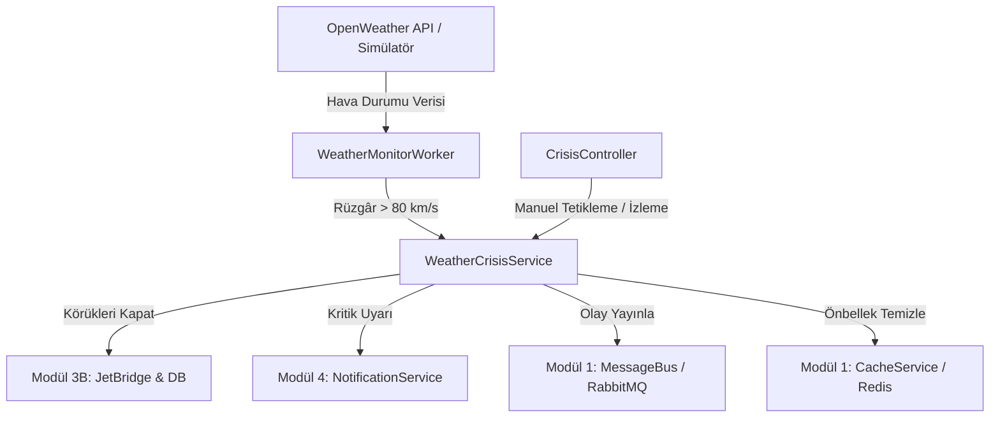

# Modül 7: Dış Veri Entegrasyonu ve Kriz Yönetimi (Simülasyonlar & Otomasyon)

Bu döküman, **AeroPulse** projesinin 7. modülü olan dış hava durumu veri entegrasyonu, otonom arka plan izleyicisi (Background Worker) ve acil durum kriz yönetimi sistemini, yazılıma yeni başlayan birinin kolayca kavrayabileceği benzetmelerle ve adım adım açıklamaktadır.

---

## 1. Modülün Amacı ve Günlük Hayattan Benzetme

### Amacı:
Havalimanları aşırı hava olaylarına (özellikle şiddetli rüzgâr, windshear, fırtına vb.) karşı en hassas tesislerdir. Rüzgâr hızı emniyet limitlerini (örn: 80 km/s) aştığında uçaklara bağlı olan yolcu körükleri (Jet Bridges) devrilebilir, uçak kapısına zarar verebilir veya yolcuların can güvenliğini tehlikeye atabilir.

Bu modülün amacı; havalimanı hava durumunu dış bir kaynaktan (OpenWeatherMap API) **otonom ve periyodik** olarak dinlemek, kritik bir eşik aşıldığında **insan müdahalesine gerek kalmadan anında acil durum protokolünü devreye sokmaktır.**

### Günlük Hayattan Benzetme:
Bir akıllı binadaki **"Yangın Algılama ve Otomatik Yağmurlama Sistemi"** gibidir:
- Sensörler sürekli havadaki dumanı ve ısıyı kontrol eder (Arka plan işçisi - `WeatherMonitorWorker`).
- Isı ve duman kritik seviyeyi geçtiğinde sistem alarm çalar, itfaiyeyi arar, asansörleri zemin kata kilitler ve kapıları açar (Kriz Yönetim Servisi - `WeatherCrisisService`).
- Tehlike geçince bina yöneticisine "Tehlike geçti, sistemler normale dönebilir" mesajı gider.

---

## 2. Bu Modülde Hangi Class'lar Oluşturuldu ve Ne İşe Yararlar?

### 1. `OpenWeatherService` (ve `IWeatherService`)
- **Katman:** `AeroPulse.Infrastructure`
- **Benzetme:** Meteoroloji İstasyonu Gözlemcisi.
- **Görevi:** OpenWeatherMap API'sine HTTP istekleri atarak (`HttpClient`) güncel sıcaklık, nem, rüzgâr hızı, rüzgâr esintisi (gust) ve hava durumu açıklamalarını çeker. API anahtarı girilmemişse sistemi kilitlemez; otomatik olarak gerçekçi simülasyon (mock) verileri üretir.

### 2. `WeatherMonitorWorker`
- **Katman:** `AeroPulse.Infrastructure / BackgroundServices`
- **Benzetme:** 7/24 nöbet tutan kule nöbetçisi.
- **Görevi:** .NET'in `BackgroundService` sınıfından türetilmiştir. Uygulama ayağa kalktığında otomatik olarak arka planda sessizce çalışmaya başlar. Belirlenen periyotta (örn: her 5 dakikada bir) hava durumunu kontrol eder, rüzgâr limitin üzerine çıktığında kriz servisini tetikler.

### 3. `WeatherCrisisService` (ve `IWeatherCrisisService`)
- **Katman:** `AeroPulse.Application`
- **Benzetme:** Kriz Masası Başkanı.
- **Görevi:** Kriz tetiklendiğinde veya çözüldüğünde yapılması gereken tüm iş mantığını (Business Logic) yürütür:
  - Körükleri emniyet amacıyla "UnderMaintenance" (Kullanım Dışı) statüsüne çeker.
  - Önbelleği (Redis/MemoryCache) temizler.
  - RabbitMQ mesaj kuyruğuna olay fırlatır.
  - Yetkili kullanıcılara (Operasyon Yöneticileri ve Adminler) acil durum bildirimi gönderir.
  - Spam koruması uygulayarak sistemin kilitlenmesini engeller.

### 4. `CrisisController`
- **Katman:** `AeroPulse.API`
- **Benzetme:** Acil Durum Butonları ve Durum Ekranı.
- **Görevi:** Ön yüzden (Angular/Mobil) veya Swagger'dan kriz durumunu sorgulamaya (`GET /api/crisis/status`), güncel hava durumunu görmeye (`GET /api/crisis/weather`) ve gerektiğinde simülasyon veya tatbikat için manuel kriz tetiklemeye (`POST /api/crisis/wind/trigger`) olanak tanır.

### 5. DTO Sınıfları (`CrisisDtos.cs`)
- **`TriggerWindCrisisRequestDto`:** Kriz başlatırken gönderilen parametreler (lokasyon, rüzgâr hızı, gerekçe).
- **`ResolveWindCrisisRequestDto`:** Krizi çözerken gönderilen parametreler (körükler açılsın mı?).
- **`CrisisOperationResultDto`:** Kriz işlemi sonucunda dönen özet bilgi (etkilenen körük adedi, bildirim sayısı).
- **`CrisisStatusDto`:** Sistemin o anki durumunu gösteren veri modeli.

---

## 3. Metotlar (Fonksiyonlar) Ne Yapıyor?

### `WeatherMonitorWorker.ExecuteAsync(CancellationToken stoppingToken)`
- **Ne Yapar?** Arka plan işçisinin kalbidir.
- **Nasıl Çalışır?** 
  1. `while (!stoppingToken.IsCancellationRequested)` döngüsüyle uygulama çalıştığı sürece döner.
  2. `IServiceScopeFactory` ile yeni bir Dependency Injection kapsamı (Scope) oluşturur.
  3. `IWeatherService.GetCurrentWeatherAsync` metodunu çağırıp rüzgâr hızını alır.
  4. Rüzgâr hızı $\ge 80$ km/s ise `IWeatherCrisisService.TriggerWindCrisisAsync` metodunu çalıştırır.
  5. Rüzgâr normale dönmüşse ve kriz aktifse `ResolveWindCrisisAsync` çağırır.
  6. `Task.Delay(checkInterval)` ile bir sonraki periyoda kadar uyur.

### `WeatherCrisisService.TriggerWindCrisisAsync(...)`
- **Ne Yapar?** Emniyet kapatmasını ve acil bildirimleri yönetir.
- **Nasıl Çalışır?**
  1. **Spam Kontrolü:** Önbellekte aktif kriz var mı? Varsa ikinci kez işlem yapmaz, sistemi yormaz.
  2. **Körüklerin Kapatılması:** Veritabanındaki tüm `JetBridge` kayıtlarını çeker ve durumlarını `JetBridgeStatus.UnderMaintenance` yapar.
  3. **Cache Invalidation:** Yolcuların ve yer ekiplerinin boştaki körükleri görmemesi için `jetbridges:available:*` önbelleklerini temizler.
  4. **Mesaj Kuyruğu:** `crisis.weather.windshear` kanalı üzerinden RabbitMQ'ya olay yayınlar.
  5. **Yetkili Bildirimi:** Sistemdeki tüm `OperationsManager` ve `Admin` kullanıcılarına kritik seviyeli bildirim (`INotificationService`) üretir.

### `WeatherCrisisService.ResolveWindCrisisAsync(...)`
- **Ne Yapar?** Fırtına dindiğinde sistemi normale döndürür.
- **Nasıl Çalışır?**
  1. Körükleri tekrar `JetBridgeStatus.Available` yapar.
  2. Önbelleği günceller.
  3. RabbitMQ'ya `crisis.weather.normal` mesajı yayınlar.
  4. Yetkililere "Hava koşulları normale döndü" bilgilendirmesi gönderir.

---

## 4. Kritik Teknik Detaylar (Mülakatlarda ve Kod İncelemesinde Önemli Noktalar)

1. **Singleton vs Scoped Çatışması (`IServiceScopeFactory`):**
   - `BackgroundService` sınıfları uygulama ömrünce tek bir kez oluşturulur (**Singleton**).
   - Ancak veritabanı bağlamı (`AeroPulseDbContext`) ve servisler her istekte yenilenir (**Scoped**).
   - Singleton bir sınıf içine doğrudan Scoped bir servis enjekte edilirse **"Cannot consume scoped service from singleton"** hatası alınır.
   - Bu yüzden `IServiceScopeFactory` kullanılarak her döngüde `using var scope = _scopeFactory.CreateScope();` ile geçici bir yaşam alanı açılarak servisler çözümlenmiştir.

2. **Aşırı Bildirim (Spam) Koruması:**
   - Worker her 5 dakikada bir çalışır. Fırtına 3 saat sürerse 36 kez bildirim atılırsa operatörler panikler ve telefonlar kilitlenir.
   - Durum önbellekte (`crisis:weather:wind:status`) tutularak "Kriz zaten aktifse tekrar bildirim atma" kuralı işletilmiştir.

3. **Birim Çevrimi (Metric / Imperial):**
   - OpenWeather API rüzgâr hızını **metre/saniye (m/s)** olarak verir.
   - Havacılıkta ve senaryomuzda eşik **km/s** cinsindendir. 
   - Matematiksel dönüşüm: $\text{Hız (km/s)} = \text{Hız (m/s)} \times 3.6$ formülüyle hassas biçimde hesaplanmıştır.

---

## 5. Diğer Modüllerle Entegrasyonu



- **Modül 3B (JetBridge):** Rüzgâr krizi anında körüklerin durumu doğrudan değiştirilir.
- **Modül 4 (Notifications):** Operatörlerin ekranına düşen pop-up ve uyarılar bu modül aracılığıyla basılır.
- **Modül 1 (Altyapı):** JWT yetkilendirmesi, Redis önbellek yönetimi ve RabbitMQ mesajlaşması kullanılır.

---

## 6. Nasıl Test Edilir? (Swagger Adımları)

Backend çalışırken `http://localhost:5146/swagger` adresine gidin:

### Test 1: Anlık Hava Durumunu Görüntüleme
1. `GET /api/crisis/weather?cityCode=LTFM` endpoint'ini açın.
2. `Execute` butonuna basın.
3. İstanbul Havalimanı için sıcaklık, rüzgâr hızı, açıklama ve basınç bilgilerinin JSON olarak döndüğünü görün.

### Test 2: Rüzgâr Krizini Manuel Tetikleme (Tatbikat / Simülasyon)
1. `Authorize` butonundan Admin veya OperationsManager token'ı ile giriş yapın.
2. `POST /api/crisis/wind/trigger` endpoint'ini açın.
3. İstek gövdesine şu JSON'ı yapıştırın:
   ```json
   {
     "cityCode": "LTFM",
     "windSpeedKmH": 95.5,
     "reason": "Acil durum tatbikatı - Şiddetli fırtına simülasyonu"
   }
   ```
4. `Execute`'a basın.
5. Sonuçta `AffectedJetBridgesCount` (kapatılan körük sayısı) ve `NotifiedUsersCount` değerlerini görün.
6. `GET /api/jet-bridges` endpoint'ini çağırıp körüklerin durumunun `UnderMaintenance` olduğunu teyit edin.
7. `GET /api/notifications` endpoint'ini çağırıp kriz uyarısının geldiğini görün.

### Test 3: Spam Korumasını Test Etme
1. Hemen ardından aynı isteği (`POST /api/crisis/wind/trigger`) tekrar gönderin.
2. Yanıt mesajında `"Kriz zaten aktif durumda... Aşırı bildirim engellendi."` ifadesini görün. Bildirimlerin tekrar atılmadığını doğrulayın.

### Test 4: Krizi Sonlandırma ve Körükleri Açma
1. `POST /api/crisis/wind/resolve` endpoint'ini açın.
2. Şu gövdeyi gönderin:
   ```json
   {
     "cityCode": "LTFM",
     "windSpeedKmH": 22.0,
     "restoreJetBridges": true
   }
   ```
3. `Execute`'a basın.
4. Körüklerin tekrar `Available` moduna geçtiğini ve normale dönüş bildiriminin iletildiğini doğrulayın.
